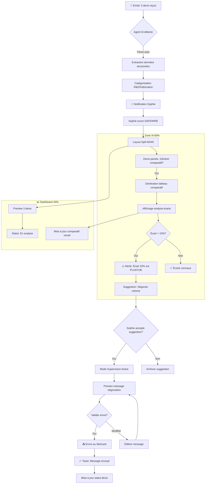
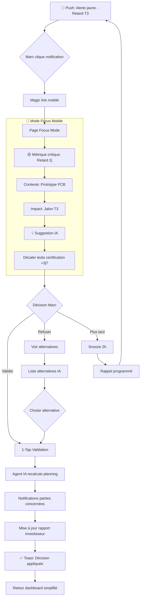
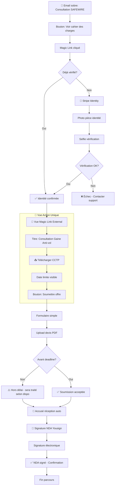
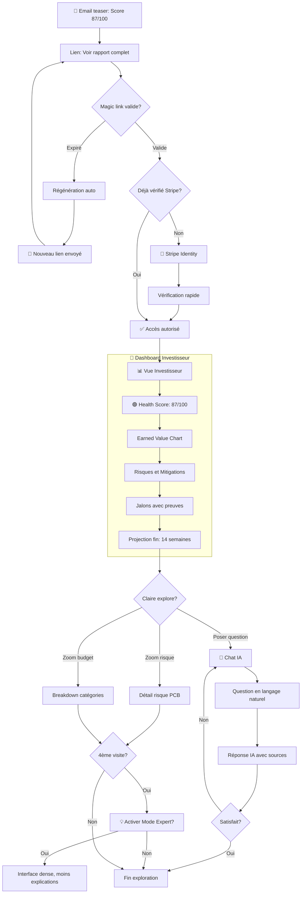

---
stepsCompleted:
  - 'step-01-init'
  - 'step-02-discovery'
  - 'step-03-core-experience'
  - 'step-04-emotional-response'
  - 'step-05-inspiration'
  - 'step-06-design-system'
  - 'step-07-defining-experience'
  - 'step-08-visual-foundation'
  - 'step-09-design-directions'
  - 'step-10-user-journeys'
  - 'step-11-component-strategy'
  - 'step-12-ux-patterns'
  - 'step-13-responsive-accessibility'
  - 'step-14-complete'
workflowStatus: 'complete'
completedAt: '2026-01-17'
inputDocuments:
  - 'prd.md'
  - 'brainstorming-session-2026-01-16.md'
  - 'business-model-paas-safewire.md'
---

# UX Design Specification - Plateforme Projet SAFEWIRE

**Auteur:** jean claude
**Date:** 2026-01-17

---

## Executive Summary

### Vision du Projet

SAFEWIRE est une plateforme **SaaS interne** développée à l'initiative de **LABOR CONTROL (MOE)** pour gérer efficacement ce projet IoT et les projets futurs. L'interface principale est un **Agent IA Omniprésent** conversationnel, avec le dashboard comme interface visuelle de backup.

> **Vision Produit (5 Whys) :** SAFEWIRE est un **multiplicateur de succès** pour les PME innovantes qui n'ont pas le droit à l'échec.

### Utilisateurs Cibles

| Rôle | Description | Type d'accès |
|------|-------------|--------------|
| **Sophie (MOE - LABOR CONTROL)** | Équipe technique, gère les aspects techniques du projet | Compte interne |
| **Marc (MOA)** | Client/Commanditaire du projet, pilotage stratégique | Compte interne |
| **Pierre (Fabricant)** | Partenaire externe, production des prototypes | Magic link |
| **Claire (Investisseur)** | Partenaire externe, suivi des investissements | Magic link |
| **Agent IA** | Interface conversationnelle omniprésente | Système |
| **Admin** | Gestion des utilisateurs et des rôles | Compte admin |
| **Onboarding** | Parcours d'intégration des nouveaux utilisateurs | Système |

### Défis de Design Clés

1. **Agent IA comme Interface Principale** - Concevoir une expérience où la conversation est le mode d'interaction dominant, avec le dashboard en "fallback" visuel

2. **Gestion Admin des Utilisateurs/Rôles** - Interface claire permettant à l'admin d'ajouter des utilisateurs, définir des rôles et gérer les permissions

3. **Accès Externes Simplifiés** - Magic links pour fabricants/investisseurs offrant une expérience "zéro friction" sans création de compte

4. **Accessibilité et Internationalisation** - Conformité WCAG 2.1 AA avec support bilingue FR/EN

### Opportunités de Design

1. **Console Admin Intuitive** - Gestion centralisée users/rôles avec visualisation claire des permissions et hiérarchie

2. **UX Conversationnelle Innovante** - Agent IA proactif qui anticipe les besoins plutôt qu'un simple chatbot réactif

3. **Onboarding Contextuel par Rôle** - Expérience d'accueil personnalisée selon le rôle attribué par l'admin

4. **Dashboard comme Miroir Visuel** - Le dashboard reflète l'état de la conversation avec l'IA, offrant une vue complémentaire et explorable

---

## Core User Experience

### Expérience Définissante

> **Pour tous :** "Mon projet avance avec le minimum d'effort de ma part."

**Expérience adaptée par persona :**

| Persona | Expérience | Formulation |
|---------|------------|-------------|
| **Internes (Sophie/Marc)** | Conversation + Dashboard | "Je dis ce que je veux, l'IA gère avec moi" |
| **Externes (Pierre/Claire)** | Action directe | "Je vois l'action, je la fais" |

L'Agent IA est **proactif** : il propose des actions, alerte sur les risques, suggère les prochaines étapes sans attendre qu'on lui demande.

### Modèle Mental Utilisateur

| Persona | Attente | Mode Préféré |
|---------|---------|--------------|
| **Sophie (MOE)** | Compréhension technique contextuelle | IA conversationnelle |
| **Marc (MOA)** | Vue synthétique 3 secondes | Dashboard first |
| **Pierre (Fabricant)** | Action claire sans friction | Bouton direct |
| **Claire (Investisseur)** | Transparence totale | Q&A + métriques |

### Stratégie Plateforme

| Aspect | Décision |
|--------|----------|
| **Type** | Application Web (Next.js) |
| **Priorité** | Desktop first, responsive mobile |
| **Input** | Clavier/souris principal, touch secondaire |
| **Connectivité** | Online requis (Agent IA cloud) |
| **Hébergement** | Scaleway |

### Interactions Effortless

| Interaction | Objectif |
|-------------|----------|
| **Conversation IA** | Parler naturellement, réponses pertinentes et contextuelles |
| **Magic Links** | Clic unique = accès immédiat, zéro mot de passe |
| **Ajout utilisateur (Admin)** | 3 clics max : nom → email → rôle → créé |
| **Bascule Conversation ↔ Dashboard** | Transition fluide, contexte préservé |

### Moments Critiques de Succès

1. **Première interaction IA** - L'utilisateur comprend immédiatement que l'IA "connaît" son projet et peut l'aider concrètement

2. **Réception Magic Link (Partenaire)** - En 10 secondes, le partenaire est dans le projet et voit clairement ce qu'on attend de lui

3. **Configuration nouveau projet (Admin)** - En moins de 5 échanges avec l'IA, le projet est structuré avec ses phases, rôles et accès

### Principes d'Expérience (First Principles)

| # | Principe | Description |
|---|----------|-------------|
| 1 | **Effort Minimum First** | La bonne interface pour la bonne tâche - pas de conversation forcée |
| 2 | **Outcome Focus** | Succès = projet livré, pas interactions IA |
| 3 | **Silence Intelligent** | L'IA intervient quand c'est utile, pas pour "être présente" |
| 4 | **Transparence Totale** | L'IA explique ce qu'elle fait et pourquoi |
| 5 | **Interface Adaptative** | Conversation / Dashboard / Action selon le contexte |

### Matrice Interface-Tâche

| Tâche | Interface | Effort Cognitif |
|-------|-----------|-----------------|
| "Où en est le projet ?" | Dashboard 3s | ⭐ Minimal |
| "Pourquoi ce retard ?" | Conversation IA | ⭐⭐ Moyen |
| "Valider ce devis" | Bouton action | ⭐ Minimal |
| "Créer une nouvelle phase" | Conversation guidée | ⭐⭐ Moyen |
| Alerte retard | Notification push | ⭐ Minimal |
| Rapport hebdo | Auto-généré + email | ⭐ Aucun |

---

## Defining Experience (Enriched)

### Flux Utilisateur Cible (45 secondes)

```
[0s]  Ouvre SAFEWIRE
[2s]  Voit Dashboard : 73% ✓ | PCB ⚠️ | Budget ✓
[5s]  "Pourquoi le risque PCB ?"
[8s]  IA répond avec contexte + sources
[15s] "Contacte Pierre pour décaler d'une semaine"
[20s] IA affiche preview du message
[25s] [Envoyer] cliqué
[27s] Toast "Message envoyé à Pierre ✓"
[30s] Dashboard mis à jour
[45s] Passe à autre chose
```

### Stack Technique Requis

| Couche | Composant | Fonction |
|--------|-----------|----------|
| **Data** | Graphe de Connaissances Projet | Qui, quoi, quand, dépendances |
| **Data** | Index Temps Réel | Données accessibles < 100ms |
| **IA** | NLP Contextuel | Comprend "Pierre" = fabricant |
| **IA** | Mémoire Conversationnelle | Résout "le risque" → celui affiché |
| **IA** | Générateur d'Actions | Rédige messages, calcule dates |
| **UI** | Dashboard 3 Secondes | KPIs above the fold |
| **UI** | Actions Inline | Boutons dans la conversation |
| **UI** | Preview & Confirm | Voir avant d'envoyer |

### Risques UX & Plan de Prévention (Pre-mortem)

| Risque | Prévention | Sprint |
|--------|------------|--------|
| **IA incompréhensible** | Onboarding projet obligatoire + Graphe connaissances | S1-S2 |
| **Latence** | Streaming + Cache + SLA < 500ms premier token | S1 |
| **Erreurs critiques** | Confirmation + Undo 30s + Preview obligatoire | S1-S2 |
| **Intrusion** | Paramètres fréquence + Score pertinence + Mode silencieux | S2-S3 |
| **Dashboard ignoré** | Landing = Dashboard + Éducation "voir vs agir" | S1-S2 |

### Règles de Sécurité UX

| # | Règle | Application |
|---|-------|-------------|
| 1 | **Confirmation avant action externe** | Email, message, modification de date |
| 2 | **Undo 30 secondes** | Toute action peut être annulée |
| 3 | **Preview systématique** | Voir le résultat avant d'exécuter |
| 4 | **Silence intelligent** | Si pertinence < 70%, ne pas notifier |
| 5 | **Fallback visible** | Dashboard toujours accessible en 1 clic |

### SLA Expérience

| Métrique | Cible | Alerte |
|----------|-------|--------|
| Premier token IA | < 500ms | > 1s |
| Réponse complète | < 3s | > 5s |
| Dashboard load | < 2s | > 3s |
| Action confirmée | < 1s | > 2s |

### Hiérarchie des Priorités (5 Whys)

| # | Priorité | Justification Business |
|---|----------|----------------------|
| 1 | **Fiabilité** | Survie entreprise → zéro bug critique |
| 2 | **Rapidité** | Temps = argent → chaque seconde compte |
| 3 | **Simplicité** | PME = ressources limitées → onboarding < 5 min |
| 4 | **Confiance** | Crédibilité partenaires → inspirer les externes |
| 5 | **Fonctionnalités** | Seulement après 1-4 |

### Promesses Produit

| À qui | Promesse |
|-------|----------|
| **Sophie (MOE)** | "Tu gagnes 2h/semaine sur l'admin projet" |
| **Marc (MOA)** | "Tu sais toujours où en est le projet" |
| **Pierre (Fabricant)** | "Tu fais ta part en 30 secondes" |
| **Claire (Investisseur)** | "Tu vois la vérité, pas du marketing" |
| **LABOR CONTROL** | "Tu multiplies tes chances de livrer" |

---

## Desired Emotional Response

### Objectifs Émotionnels par Rôle

| Rôle | Émotion Principale | Émotion Secondaire |
|------|-------------------|-------------------|
| **MOE (Sophie)** | **Efficacité** - "Je gagne du temps" | Contrôle - "Je maîtrise mon projet" |
| **MOA (Marc)** | **Clarté** - "Je comprends où on en est" | Confiance - "Le projet avance bien" |
| **Fabricant (Pierre)** | **Simplicité** - "C'est facile de collaborer" | Reconnaissance - "Mon travail est valorisé" |
| **Investisseur (Claire)** | **Transparence** - "Je vois tout" | Sérénité - "Mon investissement est suivi" |
| **Admin** | **Puissance** - "Je contrôle tout" | Rapidité - "Tout est à portée de main" |

### Parcours Émotionnel

| Moment | Émotion Visée |
|--------|---------------|
| **Première découverte** | Curiosité → "Cette IA semble vraiment utile" |
| **Première interaction IA** | Surprise positive → "Elle comprend mon contexte !" |
| **Utilisation quotidienne** | Fluidité → "C'est devenu naturel" |
| **Quand quelque chose échoue** | Réassurance → "L'IA m'aide à résoudre, pas de panique" |
| **Retour après absence** | Familiarité → "Je reprends exactement où j'en étais" |

### Micro-Émotions Critiques

| À Cultiver | À Éviter |
|------------|----------|
| ✅ **Confiance** - L'IA donne des infos fiables | ❌ **Méfiance** - "L'IA dit-elle vrai ?" |
| ✅ **Compétence** - "Je sais utiliser cet outil" | ❌ **Confusion** - "Je ne sais pas quoi faire" |
| ✅ **Accomplissement** - Chaque action donne un feedback | ❌ **Frustration** - Pas de réponse, pas de progression |
| ✅ **Appartenance** - Faire partie du projet | ❌ **Isolation** - "Je suis seul face à cet outil" |

### Implications Design

| Émotion | Choix UX |
|---------|----------|
| **Confiance** | L'IA cite ses sources, montre d'où viennent les infos, admet quand elle ne sait pas |
| **Efficacité** | Réponses rapides, suggestions proactives, raccourcis pour actions fréquentes |
| **Clarté** | Dashboard visuel simple, statuts clairs (vert/jaune/rouge), langage sans jargon |
| **Puissance (Admin)** | Vue d'ensemble, actions bulk, historique des modifications |
| **Simplicité (Externes)** | Magic link → action en 2 clics, pas de navigation complexe |

### Principes de Design Émotionnel

| # | Principe | Application |
|---|----------|-------------|
| 1 | **Humaniser l'IA** | L'Agent IA a un ton chaleureux mais professionnel, pas robotique |
| 2 | **Feedback Immédiat** | Chaque action utilisateur obtient une confirmation visuelle/textuelle |
| 3 | **Réduire l'Anxiété** | En cas d'erreur, l'IA propose une solution, pas juste un message d'erreur |
| 4 | **Célébrer les Succès** | Jalons atteints = moment de reconnaissance (subtil mais présent) |

---

## UX Pattern Analysis & Inspiration

### Produits Inspirants Analysés

#### Interfaces Conversationnelles IA
| Produit | Forces UX | Leçons pour SAFEWIRE |
|---------|-----------|---------------------|
| **ChatGPT / Claude** | Conversation naturelle, streaming de réponse, mémoire contextuelle | Réponses progressives, rappel du contexte projet |
| **GitHub Copilot Chat** | IA intégrée dans le workflow, suggestions contextuelles | IA qui connaît l'état du projet en temps réel |

#### Gestion de Projets
| Produit | Forces UX | Leçons pour SAFEWIRE |
|---------|-----------|---------------------|
| **Linear** | Interface épurée, statuts visuels, rapidité extrême | Statuts vert/jaune/rouge, navigation rapide |
| **Notion** | Flexibilité, vues multiples, édition inline | Actions sans quitter la vue courante |
| **Asana** | Timeline visuelle, suivi clair | Visualisation des phases projet |

#### Accès Externes
| Produit | Forces UX | Leçons pour SAFEWIRE |
|---------|-----------|---------------------|
| **DocuSign** | Signature en 2 clics, zéro compte | Magic links ultra-simples |
| **Loom** | Partage instantané, preview avant clic | Preview du contexte dans le magic link |

#### Consoles Admin
| Produit | Forces UX | Leçons pour SAFEWIRE |
|---------|-----------|---------------------|
| **Clerk** | Gestion users/rôles moderne et intuitive | Interface admin claire et puissante |
| **Stripe Dashboard** | Vue d'ensemble, filtres efficaces | Filtres facettés pour admin |

### Patterns UX Transférables

| Pattern | Source | Application SAFEWIRE |
|---------|--------|---------------------|
| **Streaming de réponse** | ChatGPT/Claude | L'IA répond progressivement, feedback immédiat |
| **Contexte persistant** | GitHub Copilot | L'IA "se souvient" du projet, des conversations précédentes |
| **Statuts visuels** | Linear | Codes couleur pour phases et tâches (vert/jaune/rouge) |
| **Magic link avec preview** | Loom | Le destinataire voit un aperçu avant d'accéder |
| **Actions inline** | Notion | Éditer/agir sans quitter la vue courante |
| **Filtres facettés** | Stripe | Admin filtre users par rôle, statut, date d'ajout |

### Anti-Patterns à Éviter

| Anti-Pattern | Risque | Solution SAFEWIRE |
|--------------|--------|-------------------|
| **Chatbot rigide** | Frustration, expérience non naturelle | Conversation libre avec l'Agent IA |
| **Dashboard surchargé** | Confusion, perte de clarté | Vue épurée, informations progressives |
| **Création de compte obligatoire** | Friction pour partenaires externes | Magic links sans authentification |
| **Permissions complexes** | Admin perdu, erreurs de configuration | Rôles simples avec permissions claires |
| **Notifications excessives** | Anxiété, désengagement | Notifications ciblées et actionnables |

### Stratégie d'Inspiration

**À Adopter directement :**
- Streaming de réponse IA (ChatGPT) → feedback immédiat
- Statuts visuels simples (Linear) → clarté instantanée
- Magic links avec preview (Loom) → accès zéro friction

**À Adapter au contexte :**
- Console admin (Clerk) → simplifiée pour 4-5 rôles max
- Vues multiples (Notion) → limitée à conversation + dashboard

**À Éviter absolument :**
- Complexité de Jira → trop lourd pour un SaaS interne
- Rigidité des chatbots traditionnels → contraire à "conversation first"
- Onboarding long → partenaires externes doivent agir en secondes

---

## Design System Foundation

### Choix du Design System

**Sélection : shadcn/ui + Tailwind CSS**

| Critère | Évaluation |
|---------|------------|
| **Compatibilité Next.js** | ✅ Natif, optimisé App Router |
| **Accessibilité** | ✅ Radix Primitives = WCAG 2.1 AA |
| **Customisation** | ✅ On possède le code source |
| **Performance** | ✅ Léger, tree-shaking natif |
| **Chat UI** | ✅ Composants modernes disponibles |
| **Communauté** | ✅ Très active en 2026 |

### Justification du Choix

1. **Natif Next.js** - Conçu pour App Router et Server Components, optimal pour notre stack
2. **Accessible par défaut** - Basé sur Radix Primitives, conformité WCAG 2.1 AA intégrée
3. **Propriété du code** - Composants copiés dans le projet, pas de dépendance externe
4. **Tailwind intégré** - Styling rapide, cohérent et maintenable
5. **Chat UI ready** - Composants modernes adaptés à l'Agent IA conversationnel
6. **Léger** - Pas de bundle lourd, performances optimales sur Scaleway

### Approche d'Implémentation

```
src/
├── components/
│   ├── ui/              # Composants shadcn/ui de base
│   │   ├── button.tsx
│   │   ├── card.tsx
│   │   ├── dialog.tsx
│   │   ├── input.tsx
│   │   └── ...
│   ├── chat/            # Composants Agent IA custom
│   │   ├── chat-bubble.tsx
│   │   ├── chat-input.tsx
│   │   ├── streaming-text.tsx
│   │   └── suggestion-chips.tsx
│   ├── admin/           # Composants console admin
│   │   ├── user-table.tsx
│   │   ├── role-selector.tsx
│   │   └── permission-matrix.tsx
│   └── magic-link/      # Composants accès externes
│       ├── link-preview.tsx
│       └── quick-action.tsx
├── styles/
│   └── globals.css      # Tailwind + design tokens
└── lib/
    └── utils.ts         # Utilitaires shadcn/ui
```

### Stratégie de Customisation

| Élément | Approche |
|---------|----------|
| **Couleurs** | Palette custom : primaire (bleu LABOR CONTROL), secondaire, statuts (vert/jaune/rouge) |
| **Typography** | Inter ou font système pour lisibilité optimale |
| **Spacing** | Scale Tailwind standard (base 4px) |
| **Radius** | Coins arrondis modérés (radius-md) |
| **Shadows** | Subtiles, style moderne (shadow-sm à shadow-md) |

### Composants Custom à Développer

| Composant | Usage | Priorité |
|-----------|-------|----------|
| **ChatBubble** | Messages Agent IA et utilisateur | Haute |
| **StreamingText** | Réponse IA progressive | Haute |
| **MagicLinkPreview** | Aperçu pour partenaires externes | Haute |
| **UserCard** | Affichage utilisateur dans admin | Moyenne |
| **RoleSelector** | Sélection de rôle lors de l'ajout | Moyenne |
| **ProjectStatusBadge** | Statut visuel des phases | Moyenne |
| **QuickActionButton** | Actions rapides magic link | Moyenne |

---

## Visual Design Foundation

### Color System

**Palette Principale (Dark Mode - Défaut)**

| Token | Hex | Usage |
|-------|-----|-------|
| `--color-bg-primary` | #050505 | Fond principal |
| `--color-bg-elevated` | #0A0A0A | Cartes et modales |
| `--color-text-primary` | #EDEDED | Texte principal |
| `--color-text-secondary` | #A0A0A0 | Texte secondaire |
| `--color-accent-ia` | #00D1FF | Agent IA, interactions conversationnelles |
| `--color-accent-business` | #3B82F6 | Dashboard, rapports, éléments métier |
| `--color-accent-secondary` | #FF7B54 | Alertes, notifications humaines |
| `--color-success` | #10B981 | Succès, CTAs primaires externes |
| `--color-warning` | #F59E0B | Avertissements |
| `--color-error` | #EF4444 | Erreurs |

**Theme Switching**
- Dark Mode : Défaut pour utilisateurs internes
- Light Mode : Toggle optionnel dans le header
- Print Mode : Automatique via @media print (fond blanc, texte noir)

**Glassmorphism (Mode Immersif uniquement)**
```css
.glass {
  background: rgba(255, 255, 255, 0.05);
  backdrop-filter: blur(16px);
  border: 1px solid rgba(255, 255, 255, 0.10);
}
/* Désactivé sous 768px pour performance */
@media (max-width: 768px) {
  .glass { backdrop-filter: none; border-color: rgba(255,255,255,0.15); }
}
```

**Mode par Défaut (War Room Decision)**
- App métier (dashboard, gestion) → Safe Mode
- Onboarding, présentations → Immersif opt-in
- Agent IA → Animations subtiles

### Typography System

**Famille de Polices (2 familles optimisées)**
- **Inter** : Headings (600-700) + Body (400-500)
- **JetBrains Mono** : Code et données techniques

**Density Modes (Focus Group Insight)**

| Mode | Body Size | Line Height | Usage |
|------|-----------|-------------|-------|
| Comfortable | 16px | 1.6 | Défaut, nouveaux utilisateurs |
| Compact | 14px | 1.5 | Power users (Sophie), haute densité |

**Échelle Typographique**

| Token | Comfortable | Compact | Usage |
|-------|-------------|---------|-------|
| `--text-xs` | 12px | 11px | Labels, badges |
| `--text-sm` | 14px | 13px | Corps secondaire |
| `--text-base` | 16px | 14px | Corps principal |
| `--text-lg` | 20px | 18px | Lead text |
| `--text-xl` | 24px | 22px | Sous-titres |
| `--text-2xl` | 30px | 28px | H3 |
| `--text-3xl` | 36px | 32px | H2 |
| `--text-4xl` | 48px | 42px | H1 |

### Spacing & Layout Foundation

**Unité de Base** : 4px (Comfortable) / 3px (Compact)

**Grid System**
- Container max-width : 1280px
- Colonnes : 12 (desktop), 6 (tablette), 4 (mobile)
- Gutter : 24px (Comfortable) / 16px (Compact)

**CTA Hierarchy (Pierre's Rule)**

| Type | Hauteur Min | Style | Usage |
|------|-------------|-------|-------|
| Primary External | 48px | Solid `#10B981`, full-width mobile | Actions critiques utilisateurs externes |
| Primary Internal | 40px | Solid `#3B82F6` | Actions principales internes |
| Secondary | 36px | Outlined | Actions secondaires |
| Tertiary | 32px | Ghost | Actions tertiaires |

**Health Score Widget (Claire's Need)**
- Position : Coin supérieur droit dashboard
- Taille : 64x64px minimum
- Couleurs : Vert (#10B981) / Jaune (#F59E0B) / Rouge (#EF4444)
- Visible sans scroll, cliquable pour détails

### Accessibility Considerations

**Dual-State Architecture (from Creative_Spec.md)**
- Toggle accessibilité dans le header
- Détection automatique `prefers-reduced-motion`
- Safe Mode = pas de blur, pas de 3D, transitions instantanées

**Contraste WCAG 2.1 AA**

| Combinaison | Ratio | Conformité |
|-------------|-------|------------|
| `#EDEDED` sur `#050505` | 18.1:1 | ✅ AAA |
| `#00D1FF` sur `#050505` | 10.2:1 | ✅ AAA |
| `#10B981` sur `#050505` | 8.6:1 | ✅ AAA |

**Focus States**
- Outline : 2px solid `#00D1FF`
- Offset : 2px
- Jamais masqué

**Print Compatibility (Claire's Need)**
- Graphiques : patterns distincts en plus des couleurs
- Fond : blanc `#FFFFFF`
- Texte : noir `#1A1A1A`
- Images de fond : désactivées

**Light Mode Option (Marc's Need)**
- Toggle dans header pour environnements lumineux
- Fond : `#FAFAFA`
- Texte : `#1A1A1A`
- Accents : mêmes couleurs, saturées différemment

---

## Design Direction Decision

### Design Directions Explored

Six directions de design ont été générées et évaluées pour SAFEWIRE :

| # | Direction | Persona Cible | Concept |
|---|-----------|---------------|---------|
| 01 | Conversation-First Split | Sophie (MOE) | IA 60% + Dashboard 40%, contexte permanent |
| 02 | Dashboard-First Modal | Marc (MOA) | Dashboard full, IA en modal overlay |
| 03 | Command Palette Central | Power Users | Cmd+K minimaliste, style Linear/Raycast |
| 04 | Immersive 3D Hero | Claire (Investisseur) | 3D Spline, cartes flottantes, wow factor |
| 05 | Bento Grid Dense | Sophie (Power User) | Grille dense, mode compact, max info |
| 06 | Magic Link External | Pierre (Fabricant) | Action unique, bouton 48px, zéro navigation |

Showcase interactif généré : `ux-design-directions.html`

### Chosen Direction

**Approche Hybride Multi-Persona**

L'interface SAFEWIRE adopte une approche hybride adaptée à chaque type d'utilisateur :

**1. Utilisateurs Internes (Sophie, Marc) - Direction 01 Base**
- Layout Split 60/40 : Conversation IA à gauche, Dashboard contextuel à droite
- Transition fluide entre modes conversation et consultation
- Safe Mode par défaut (pas de glassmorphism, animations subtiles)
- Cmd+K disponible comme raccourci power-user (Direction 03)

**2. Utilisateurs Externes (Pierre, Claire) - Direction 06**
- Vue Magic Link ultra-simplifiée
- Une seule action visible par écran
- Bouton CTA primaire 48px, vert (#10B981), full-width mobile
- Zéro navigation, zéro complexité

**3. Présentations/Onboarding - Direction 04 (opt-in)**
- Mode Immersif activable pour impressionner les investisseurs
- 3D Spline optionnel, fallback image en Safe Mode
- Réservé aux contextes marketing/démonstration

### Design Rationale

**Pourquoi l'approche hybride ?**

| Critère | Justification |
|---------|---------------|
| **Effort Minimum First** | Chaque persona obtient l'interface optimale pour son usage |
| **Principe 80/20** | 80% du temps interne = Split view, 20% externe = Magic Link |
| **Accessibilité** | Safe Mode par défaut respecte `prefers-reduced-motion` |
| **Performance** | Pas de 3D/blur en usage quotidien, seulement opt-in |
| **Scalabilité** | Architecture modulaire permet d'ajouter des vues spécialisées |

**Trade-offs acceptés :**
- Complexité de développement légèrement supérieure (3 layouts vs 1)
- Nécessite routing intelligent basé sur le type d'utilisateur
- Mode Immersif = effort supplémentaire pour cas d'usage limités

### Implementation Approach

**Phase 1 - Core Layout (Sprint 1-2)**
- Implémenter le layout Split 60/40 comme base
- Créer les composants chat (ChatBubble, StreamingText)
- Construire le dashboard panel contextuel
- Ajouter le Health Score Widget (coin supérieur droit)

**Phase 2 - External Views (Sprint 2-3)**
- Implémenter le template Magic Link
- Créer les composants QuickAction et MagicLinkPreview
- Routing basé sur le token de magic link

**Phase 3 - Power Features (Sprint 3-4)**
- Ajouter Command Palette (Cmd+K)
- Implémenter le toggle density (Comfortable/Compact)
- Ajouter le toggle theme (Dark/Light)

**Phase 4 - Immersive Mode (Sprint 4+)**
- Intégration Spline 3D optionnelle
- Glassmorphism pour mode Immersif
- Animations Framer Motion avancées

---

## User Journey Flows

### Flow 1: Sophie - Analyse Devis Fabricants

**Contexte :** Sophie reçoit 3 devis fabricants et doit les analyser pour Marc.



**Points clés :**
- Agent IA parse automatiquement les emails
- Layout Split 60/40 affiche IA + Dashboard contextuellement
- Mode Supervision Active avant envoi externe
- Feedback immédiat (Toast)

### Flow 2: Marc - Validation Mobile Alerte

**Contexte :** Marc reçoit une alerte de retard potentiel et doit décider depuis son mobile.



**Points clés :**
- Mode Focus : UNE métrique critique en avant
- Validation 1-tap depuis mobile
- Agent IA cascade automatiquement les impacts
- Pas de login requis (magic link)

### Flow 3: Pierre - Onboarding Fabricant

**Contexte :** Pierre (PLASTUB) reçoit une invitation pour répondre à une consultation.



**Points clés :**
- Vérification Stripe Identity AVANT accès docs
- Vue Magic Link ultra-simplifiée (Direction 06)
- Comportement deadline transparent
- Bouton CTA 48px vert pour action principale

### Flow 4: Claire - Rapport Investisseur

**Contexte :** Claire (investisseur) consulte le rapport hebdomadaire et explore les détails.



**Points clés :**
- Email teaser seulement (pas de données sensibles)
- Régénération magic link automatique si expiré
- Mode Expert progressif après 4 visites
- Chat IA disponible pour questions

### Journey Patterns

**Patterns de Navigation**

| Pattern | Usage | Composants |
|---------|-------|------------|
| Magic Link Entry | Accès externes (Pierre, Claire, Marc mobile) | `MagicLinkPreview`, `QuickAction` |
| Split View Navigation | Internes (Sophie, Marc desktop) | Layout 60/40, transitions fluides |
| Command Palette | Power users | `Cmd+K`, recherche unifiée |

**Patterns de Décision**

| Pattern | Usage | Composants |
|---------|-------|------------|
| Mode Supervision Active | Avant envoi externe | Preview modal, Valider/Modifier |
| 1-Tap Validation | Validation rapide mobile | Bouton 48px, confirmation toast |
| Mode Focus | Décision urgente | Une métrique, contexte minimal |

**Patterns de Feedback**

| Pattern | Usage | Composants |
|---------|-------|------------|
| Streaming IA | Réponses chat | `StreamingText`, SSE |
| Toast Notifications | Confirmations actions | Toast avec undo 30s |
| Progress Indicators | Actions longues | Skeleton, progress bar |

### Flow Optimization Principles

**Principes d'Optimisation UX**

| Principe | Application |
|----------|-------------|
| **Minimal Steps to Value** | Pierre valide en 3 clics max |
| **Progressive Disclosure** | Claire voit Health Score d'abord, détails au clic |
| **Error Prevention** | Mode Supervision Active empêche envois erronés |
| **Graceful Recovery** | Magic links expirés se régénèrent automatiquement |
| **Immediate Feedback** | Toast après chaque action, streaming IA |

**Métriques Cibles par Flow**

| Flow | Métrique | Cible |
|------|----------|-------|
| Sophie - Analyse Devis | Temps comparatif | < 10 min |
| Marc - Validation | Temps décision | < 2 min |
| Pierre - Onboarding | Temps total | < 30 min cumulées |
| Claire - Rapport | Temps exploration | < 5 min |

---

## Component Strategy

### Design System Components

**Design System :** shadcn/ui + Tailwind CSS (Radix Primitives)

**Composants Foundation Disponibles :**

| Catégorie | Composants |
|-----------|------------|
| Forms | Button, Input, Textarea, Select, Checkbox, Radio, Switch |
| Layout | Card, Separator, Scroll Area |
| Feedback | Alert, Toast, Progress, Skeleton |
| Overlay | Dialog, Sheet, Popover, Tooltip, Dropdown Menu |
| Navigation | Tabs, Navigation Menu, Breadcrumb |
| Data Display | Avatar, Badge, Table, Calendar |

**Gap Analysis :**

| Besoin | shadcn/ui | Action |
|--------|-----------|--------|
| ChatBubble | Non disponible | Custom |
| StreamingText | Non disponible | Custom |
| HealthScore Widget | Non disponible | Custom |
| MagicLinkLayout | Non disponible | Custom |
| SplitLayout | Non disponible | Custom |
| FocusModeCard | Non disponible | Custom |
| CommandPalette | Partiel (Command) | Extend |
| SupervisionModal | Non disponible | Custom |

### Custom Components

#### ChatBubble

**Purpose :** Afficher les messages dans la conversation Agent IA / Utilisateur

**Props :**
- `sender: 'user' | 'ai' | 'system'`
- `content: string` (markdown support)
- `timestamp: Date`
- `status: 'sending' | 'sent' | 'error'`
- `actions?: Action[]`

**States :** Default, Sending, Sent, Error, Streaming
**Variants :** User (right-aligned), AI (left-aligned, cyan border), System
**Accessibility :** role="article", aria-label="Message de [sender]"

#### StreamingText

**Purpose :** Afficher les réponses IA en temps réel avec effet de typing

**Props :**
- `content: string`
- `speed: 'slow' | 'medium' | 'fast'`
- `onComplete: () => void`

**States :** Idle, Streaming, Complete, Paused
**Accessibility :** aria-live="polite", aria-busy pendant streaming

#### HealthScore

**Purpose :** Indicateur visuel santé projet (Claire's Need)

**Props :**
- `score: number` (0-100)
- `size: 'sm' | 'md' | 'lg'`
- `onClick?: () => void`

**States :** Green (>80%), Yellow (50-80%), Red (<50%)
**Size :** 64x64px minimum
**Accessibility :** role="status", aria-label="Santé projet: [score]%"

#### MagicLinkLayout

**Purpose :** Layout ultra-simplifié pour accès externes (Direction 06)

**Props :**
- `userName: string`
- `projectName: string`
- `action: ActionConfig`
- `expiresAt: Date`

**Anatomy :** Logo → Greeting → Action Card → CTA 48px → Expiration
**Accessibility :** Focus automatique sur CTA, navigation clavier simple

#### SplitLayout

**Purpose :** Layout 60/40 pour internes (Direction 01)

**Props :**
- `leftContent: ReactNode`
- `rightContent: ReactNode`
- `ratio: '60/40' | '50/50' | '70/30'`
- `collapsible: boolean`

**Responsive :** Stack vertical sur mobile (<768px)
**Accessibility :** Landmarks appropriés, resize handle accessible

#### FocusModeCard

**Purpose :** Carte décision urgente avec une seule métrique (Marc mobile)

**Props :**
- `metric: { label: string, value: string, status: 'normal' | 'warning' | 'critical' }`
- `context: string`
- `suggestion: string`
- `actions: Action[]`

**States :** Normal, Warning (yellow), Critical (red)
**Accessibility :** role="alertdialog" si critique

#### CommandPalette

**Purpose :** Recherche unifiée + commandes IA (Cmd+K)

**Extends :** shadcn/ui Command

**Extensions :**
- Section "Poser une question à l'IA"
- Section "Actions rapides"
- Section "Navigation"
- Historique récent
- Raccourcis clavier affichés

**Keyboard :** Cmd+K ouvre, Escape ferme, flèches naviguent

#### SupervisionModal

**Purpose :** Preview avant envoi externe (Mode Supervision Active)

**Props :**
- `type: 'email' | 'message' | 'action'`
- `content: string`
- `recipient: string`
- `onSend: () => void`
- `onEdit: () => void`
- `onCancel: () => void`

**States :** Preview, Editing, Sending, Sent, Error
**Accessibility :** Focus trap, Escape annule

### Component Implementation Strategy

**Principes d'Implémentation :**

1. **Design Tokens First** - Tous les composants custom utilisent les tokens Tailwind définis
2. **Composition over Inheritance** - Composants composables via slots et children
3. **Accessibility by Default** - ARIA labels et keyboard navigation intégrés
4. **State Management** - React state local + Context pour états partagés
5. **Motion Config** - Hook `useMotionConfig()` respecte prefers-reduced-motion

**Structure Fichiers :**

```
src/components/
├── ui/                    # shadcn/ui base
├── chat/                  # ChatBubble, StreamingText
├── layouts/               # SplitLayout, MagicLinkLayout
├── widgets/               # HealthScore, FocusModeCard
├── modals/                # SupervisionModal, CommandPalette
└── patterns/              # Compositions réutilisables
```

### Implementation Roadmap

**Phase 1 - Core Layout (Sprint 1)**

| Composant | Dépendance | Effort |
|-----------|------------|--------|
| SplitLayout | Layout de base interne | M |
| MagicLinkLayout | Layout accès externes | M |
| Tailwind tokens config | Design tokens | S |

**Phase 2 - Chat Components (Sprint 1-2)**

| Composant | Dépendance | Effort |
|-----------|------------|--------|
| ChatBubble | Flow Sophie conversation | M |
| StreamingText | Réponses IA temps réel | L |
| SSE integration | Backend streaming | L |

**Phase 3 - Dashboard Components (Sprint 2)**

| Composant | Dépendance | Effort |
|-----------|------------|--------|
| HealthScore | Dashboard Marc, Claire | S |
| FocusModeCard | Flow Marc mobile | M |
| ComparisonTable (extend Table) | Flow Sophie devis | M |

**Phase 4 - Power Features (Sprint 3)**

| Composant | Dépendance | Effort |
|-----------|------------|--------|
| CommandPalette | Power users | L |
| SupervisionModal | Flow Sophie envois | M |
| Framer Motion setup | Animations | M |

**Légende Effort :** S = Small (< 1 jour), M = Medium (1-3 jours), L = Large (3-5 jours)

---

## UX Consistency Patterns

### Button Hierarchy

#### Primary Actions (CTA)

| Type | Hauteur | Style | Usage |
|------|---------|-------|-------|
| External Magic Link | `h-12` (48px) | `bg-success` (#10B981), rounded-full | Actions critiques externes |
| Internal Primary | `h-10` (40px) | `bg-accent-business` (#3B82F6), rounded-lg | Actions principales internes |
| IA-Triggered | `h-10` | `bg-accent-ia` (#00D1FF), text-black, rounded-lg | Actions suggérées par l'IA |

**Hover State :** `brightness-110`, `scale-[1.02]`, `transition-all 150ms`

#### Secondary Actions

| Type | Hauteur | Style | Usage |
|------|---------|-------|-------|
| Ghost | `h-9` (36px) | `variant="ghost"`, `text-muted-foreground` | Actions secondaires |
| Outline | `h-9` (36px) | `variant="outline"`, `border-border` | Actions alternatives |
| Compact | `h-8` (32px) | Même variants, mode dense | Power users |

#### Destructive Actions

- **Color :** `bg-destructive` (#EF4444)
- **Confirmation :** Toujours exiger confirmation via dialog
- **Icon :** Lucide `Trash2` ou `AlertTriangle` prefix

#### Pierre's Rule (CTA Hierarchy)

Un seul CTA primary visible par viewport. Secondaires en ghost/outline.

### Feedback Patterns

#### Toast Notifications

```typescript
// Configuration
position: "bottom-right"
duration: 4000 // standard
duration: 8000 // errors

// Variants
success: { icon: CheckCircle, bg: "success/10", border: "success" }
error: { icon: XCircle, bg: "destructive/10", border: "destructive" }
warning: { icon: AlertTriangle, bg: "warning/10", border: "warning" }
info: { icon: Info, bg: "accent-business/10", border: "accent-business" }
```

#### IA Streaming Feedback

| État | Comportement | Composant |
|------|--------------|-----------|
| Typing | 3 dots animés `animate-pulse` | TypingIndicator |
| Streaming | Effet machine à écrire, `font-mono` | StreamingText |
| Sources | Chips cliquables sous la réponse | SourceChips |
| Error | "Reformulez votre question" + suggestions | ErrorRecovery |

#### Progress Indicators

| Type | Usage | Style |
|------|-------|-------|
| Determinate | Uploads, exports | Progress bar + pourcentage |
| Indeterminate | Fetches rapides | Spinner `animate-spin` |
| Skeleton | Chargement contenu | `bg-muted animate-pulse` |

#### Validation Feedback

| État | Comportement |
|------|--------------|
| Inline Error | Message rouge sous champ, icon `AlertCircle` |
| Success | Border `success`, icon `CheckCircle` |
| Real-time | Debounce 300ms pour validation async |

### Form Patterns

#### Input Fields

```typescript
// Dimensions
height: "h-10" // 40px
padding: "px-3 py-2"
border: "border border-input"
focus: "ring-2 ring-accent-business ring-offset-2"

// Label
position: "above" // jamais placeholder-as-label
required: "* required" // suffix rouge
```

#### Form Layout

| Pattern | Usage | Contrainte |
|---------|-------|------------|
| Single Column | Mobile-first | `max-w-[480px]` |
| Two Column | Desktop only | Champs liés (Prénom/Nom) |
| Section Dividers | Formulaires longs | `<Separator />` + titre |
| Submit Placement | Toujours visible | Sticky si form long |

#### Error Handling

| Niveau | Comportement |
|--------|--------------|
| Field-level | Message inline immédiat |
| Form-level | Toast + scroll vers premier champ erreur |
| Server Errors | Banner rouge en haut du form |

#### Onboarding Fabricant (Pierre's Journey)

- **Progressive Disclosure :** 4 étapes, progress bar visible
- **Save Draft :** Auto-save toutes les 30s, indicator discret
- **Validation :** Par étape avant navigation suivante

### Navigation Patterns

#### Split View Navigation (Internal Users)

```typescript
// Layout Grid
grid: "grid-cols-[minmax(400px,1fr)_minmax(600px,2fr)]"
gap: "gap-0"
divider: "border-r border-border"

// Panel States
collapsed: "w-16" // icon-only sidebar
expanded: "w-64" // full sidebar
```

#### Magic Link Entry (External Users)

| État | Comportement |
|------|--------------|
| Landing | Full-screen centered, logo + single CTA |
| Auth Flow | Skeleton → Validation → Redirect |
| Error | Clear message + "Demander un nouveau lien" |
| Expiration | 24h warning, soft-expire avec refresh option |

#### Command Palette (Power Users)

```typescript
// Trigger
hotkey: "Cmd+K" | "Ctrl+K"
button: "Search..." pill in header

// Behavior
fuzzy_search: true
recent_commands: 5
sections: ["Pages", "Actions", "Fabricants", "Devis"]
```

#### Breadcrumbs

| Viewport | Comportement |
|----------|--------------|
| Desktop | Full path avec chevrons |
| Mobile | Back button + current page only |
| Max Depth | 4 niveaux, truncate middle si plus |

### Modal & Overlay Patterns

#### Dialog Sizing

| Variant | Width | Usage |
|---------|-------|-------|
| sm | `max-w-sm` (384px) | Confirmations |
| md | `max-w-md` (448px) | Forms simples |
| lg | `max-w-lg` (512px) | Forms complexes |
| xl | `max-w-xl` (576px) | Supervision Modal |
| full | `max-w-4xl` (896px) | Data tables |

#### SupervisionModal (Admin Override)

- **Backdrop :** `bg-black/80` (plus sombre que standard)
- **Header :** Icon `Shield` + "Mode Supervision"
- **Footer :** Actions primaire + "Annuler et retourner"
- **Audit Log :** Action logged avec timestamp et raison

#### Confirmation Dialogs

| Type | Style | Comportement |
|------|-------|--------------|
| Destructive | Rouge, titre "Êtes-vous sûr ?" | Input confirmation requis |
| Standard | Neutral, titre action | Boutons Annuler/Confirmer |
| Auto-dismiss | Jamais pour destructives | Timer visible si applicable |

#### Sheet (Mobile)

- **Direction :** `side="bottom"` par défaut
- **Height :** `max-h-[85vh]`, draggable handle
- **Dismiss :** Swipe down ou tap backdrop

### Loading & Empty States

#### Loading States

```typescript
// Skeleton Patterns
text: "h-4 bg-muted rounded animate-pulse"
avatar: "h-10 w-10 rounded-full bg-muted animate-pulse"
card: "h-32 bg-muted rounded-lg animate-pulse"

// IA Response Loading
typing: "flex gap-1 items-center"
dots: "w-2 h-2 rounded-full bg-accent-ia animate-bounce"
```

#### Empty States

| État | Contenu | Action |
|------|---------|--------|
| No Data | Illustration + message | CTA primary |
| No Results | "Aucun résultat pour..." | Suggestions alternatives |
| Error State | Icon warning + message | "Réessayer" |
| First Time | Onboarding hint | CTA "Commencer" |

#### Health Score Widget (Claire's Need)

```typescript
// States
excellent: { color: "success", label: "Excellent", threshold: ">80%" }
good: { color: "accent-business", label: "Bon", threshold: "60-80%" }
warning: { color: "warning", label: "Attention", threshold: "40-60%" }
critical: { color: "destructive", label: "Critique", threshold: "<40%" }

// Animation
entry: "animate-in fade-in slide-in-from-bottom-4"
value_change: "transition-all duration-500"
```

### Density Mode Patterns

#### Comfortable Mode (Default)

```typescript
spacing: {
  gap: "gap-4",      // 16px
  padding: "p-4",    // 16px
  text: "text-base", // 16px
}
target: "Nouveaux utilisateurs, Claire, Pierre"
```

#### Compact Mode (Power Users)

```typescript
spacing: {
  gap: "gap-2",      // 8px
  padding: "p-2",    // 8px
  text: "text-sm",   // 14px
}
target: "Sophie, utilisateurs expérimentés"
```

### Accessibility Patterns

#### Focus Management

| Pattern | Comportement |
|---------|--------------|
| Visible Focus | `ring-2 ring-accent-business ring-offset-2` |
| Skip Links | Premier élément, visible on focus |
| Modal Trap | Focus trapped, escape to close |
| Return Focus | Après modal close, focus sur trigger |

#### Keyboard Navigation

| Touche | Action |
|--------|--------|
| Tab | Navigation logique, haut→bas, gauche→droite |
| Arrow Keys | Navigation dans listes/menus |
| Enter/Space | Activation boutons/liens |
| Escape | Fermer modals/dropdowns |

#### Screen Reader Support

| Élément | Requirement |
|---------|-------------|
| Boutons icon-only | `aria-label` descriptif |
| Toasts | `aria-live="polite"` |
| Headings | Hiérarchie h1→h6 stricte |
| Images | Alt text descriptif |
| Streaming IA | `aria-busy` pendant streaming |

---

## Responsive Design & Accessibility

### Responsive Strategy

#### Device-Specific Approaches

| Device | Persona Principal | Layout Strategy |
|--------|-------------------|-----------------|
| Desktop (1024px+) | Sophie (MOE) | Split 60/40, Cmd+K, mode Compact optionnel |
| Tablet (768-1023px) | Marc (MOA) déplacé | Stack vertical, IA collapsed by default |
| Mobile (<768px) | Marc (alertes), Pierre (Magic Link) | Focus Mode, Magic Link full-screen |

#### Desktop Strategy (1024px+)

**Layout Split 60/40:**
```typescript
// Internal Users
container: "grid grid-cols-[minmax(400px,1fr)_minmax(600px,2fr)]"
chat_panel: "col-span-1 border-r border-border overflow-y-auto"
dashboard_panel: "col-span-1 overflow-y-auto"
```

**Features Desktop-Only:**
- Command Palette (Cmd+K)
- Mode Compact toggle dans les préférences
- Multi-column data tables
- Hover previews (tooltips enrichis)
- Glassmorphism en mode Immersif

#### Tablet Strategy (768-1023px)

**Layout Stack:**
```typescript
// Collapse to single column
container: "flex flex-col"
chat_panel: "h-[50vh]"
dashboard_panel: "h-[50vh]"
toggle: "floating-action-button bottom-4 right-4"
```

**Adaptations Tablet:**
- Toggle flottant pour basculer Chat ↔ Dashboard
- Touch targets minimum 44x44px
- Swipe gestures pour navigation entre panels
- Pas de glassmorphism (performance)

#### Mobile Strategy (<768px)

**Magic Link External (Pierre, Claire):**
```typescript
layout: "flex flex-col min-h-screen px-4 py-8"
cta: "fixed bottom-6 left-4 right-4 h-12" // 48px, sticky
content: "flex-1 overflow-y-auto"
```

**Focus Mode (Marc - Alertes):**
```typescript
layout: "flex flex-col items-center justify-center min-h-screen p-6"
metric: "text-4xl font-bold" // Une seule métrique
actions: "grid grid-cols-2 gap-4 w-full mt-8"
```

**Internal Mobile (Sophie):**
- Bottom navigation avec 4-5 icônes max
- Chat en full-screen, Dashboard en page séparée
- Pull-to-refresh pour actualisation
- Hamburger menu pour navigation secondaire

### Breakpoint Strategy

#### Breakpoints Tailwind (Mobile-First)

| Token | Pixels | Usage |
|-------|--------|-------|
| `sm` | 640px | Petits téléphones paysage |
| `md` | 768px | Tablettes portrait |
| `lg` | 1024px | Tablettes paysage / Desktop |
| `xl` | 1280px | Desktop large |
| `2xl` | 1536px | Écrans ultrawide |

#### Breakpoints Critiques SAFEWIRE

| Breakpoint | Changement Majeur |
|------------|-------------------|
| < 768px | Stack vertical, IA en page séparée, Magic Link full |
| 768px+ | Split layout disponible, toggle visible |
| 1024px+ | Split 60/40 par défaut, Cmd+K activé |
| 1280px+ | Mode Compact recommandé pour power users |

#### Media Queries Pattern

```css
/* Mobile-first approach */
.layout {
  display: flex;
  flex-direction: column;
}

@media (min-width: 768px) {
  .layout {
    flex-direction: row;
  }
}

@media (min-width: 1024px) {
  .layout {
    display: grid;
    grid-template-columns: minmax(400px, 1fr) minmax(600px, 2fr);
  }
}
```

### Accessibility Strategy

#### WCAG 2.1 AA Compliance (Cible)

SAFEWIRE vise la conformité **WCAG 2.1 AA** — standard industrie pour applications SaaS B2B.

**Pourquoi AA et non AAA ?**
- AAA trop restrictif pour applications interactives complexes
- AA satisfait obligations légales (RGAA, ADA)
- shadcn/ui (Radix) fournit AA out-of-the-box

#### Contrast Requirements

| Élément | Ratio Minimum | Ratio SAFEWIRE | Statut |
|---------|---------------|----------------|--------|
| Texte normal | 4.5:1 | 18.1:1 (#EDEDED/#050505) | ✅ AAA |
| Texte large | 3:1 | 18.1:1 | ✅ AAA |
| Composants UI | 3:1 | 10.2:1 (#00D1FF/#050505) | ✅ AAA |
| Focus indicator | 3:1 | 10.2:1 | ✅ AAA |

#### Keyboard Navigation Requirements

| Pattern | Implémentation |
|---------|----------------|
| Tab order | Logique de haut en bas, gauche à droite |
| Skip links | Premier élément focusable, visible on focus |
| Focus trap | Modals et overlays |
| Focus visible | `ring-2 ring-accent-business ring-offset-2` |
| Escape key | Ferme tous les overlays |

#### Screen Reader Support

| Élément | Requirement ARIA |
|---------|------------------|
| Landmarks | `<header>`, `<main>`, `<nav>`, `<aside>` |
| Buttons icon-only | `aria-label="[action]"` |
| Live regions | `aria-live="polite"` pour toasts, streaming |
| Loading states | `aria-busy="true"` pendant streaming IA |
| Error messages | `aria-describedby` lié au champ |

#### Motion & Animation

```typescript
// Respect prefers-reduced-motion
const motionConfig = {
  default: {
    transition: { duration: 0.2, ease: "easeOut" },
    initial: { opacity: 0, y: 10 },
    animate: { opacity: 1, y: 0 },
  },
  reduced: {
    transition: { duration: 0 },
    initial: { opacity: 1 },
    animate: { opacity: 1 },
  },
}

// Hook usage
const { prefersReducedMotion } = useMotionConfig()
const variants = prefersReducedMotion ? motionConfig.reduced : motionConfig.default
```

#### Touch Target Sizes

| Élément | Minimum | SAFEWIRE |
|---------|---------|----------|
| Buttons | 44x44px | 40px (h-10) + 4px margin = 44px |
| Links | 24x24px | 36px+ via padding |
| Form inputs | 44x44px | 40px (h-10) + 4px spacing |
| CTA Mobile | 48x48px | 48px (h-12) |

### Testing Strategy

#### Responsive Testing Matrix

| Device | OS | Navigateur | Priorité |
|--------|-----|-----------|----------|
| iPhone 14 Pro | iOS 17 | Safari | P0 |
| Samsung Galaxy S23 | Android 14 | Chrome | P0 |
| iPad Pro 12.9" | iPadOS 17 | Safari | P1 |
| MacBook Pro 14" | macOS | Chrome/Safari | P0 |
| Windows Desktop | Win 11 | Chrome/Edge | P1 |

#### Accessibility Testing Tools

| Outil | Usage | Phase |
|-------|-------|-------|
| axe DevTools | Audit automatique | CI/CD |
| Lighthouse | Score accessibilité | CI/CD |
| WAVE | Analyse visuelle | Review |
| VoiceOver (macOS) | Screen reader testing | QA |
| NVDA (Windows) | Screen reader testing | QA |

#### Testing Checklist

**Automated (CI/CD):**
- [ ] axe-core scan 0 violations
- [ ] Lighthouse accessibility > 90
- [ ] Color contrast ratio check
- [ ] HTML validation

**Manual (QA):**
- [ ] Keyboard-only navigation complete
- [ ] Screen reader flow coherent
- [ ] Focus visible at all times
- [ ] Touch targets adequate on mobile
- [ ] Zoom 200% usable

**User Testing:**
- [ ] Test avec utilisateurs malvoyants (Claire potentiellement)
- [ ] Test avec utilisateurs moteurs (clavier only)
- [ ] Test sur connexions lentes (Marc terrain)

### Implementation Guidelines

#### Responsive Development Rules

1. **Mobile-First CSS**
```css
/* Base: mobile */
.component { padding: 1rem; }

/* Enhancement: tablet+ */
@media (min-width: 768px) {
  .component { padding: 1.5rem; }
}
```

2. **Fluid Typography**
```css
/* clamp(min, preferred, max) */
font-size: clamp(1rem, 2.5vw, 1.25rem);
```

3. **Relative Units**
- `rem` pour spacing et font-size
- `%` et `fr` pour layouts
- `vh/vw` avec précaution (100vh mobile = problème)
- `dvh` (dynamic viewport height) pour mobile full-screen

4. **Image Optimization**
```typescript
// Next.js Image avec responsive
<Image
  src="/hero.jpg"
  sizes="(max-width: 768px) 100vw, (max-width: 1200px) 50vw, 33vw"
  priority
/>
```

#### Accessibility Development Rules

1. **Semantic HTML First**
```html
<!-- Correct -->
<button onClick={...}>Submit</button>

<!-- Incorrect -->
<div onClick={...} role="button">Submit</div>
```

2. **Form Labels**
```tsx
<Label htmlFor="email">Email *</Label>
<Input id="email" name="email" aria-required="true" />
{error && <p id="email-error" role="alert">{error}</p>}
```

3. **Focus Management**
```typescript
// After modal close
const triggerRef = useRef<HTMLButtonElement>(null)

const closeModal = () => {
  setOpen(false)
  triggerRef.current?.focus() // Return focus
}
```

4. **Skip Link Pattern**
```tsx
<a
  href="#main-content"
  className="sr-only focus:not-sr-only focus:absolute focus:top-4 focus:left-4"
>
  Skip to main content
</a>
```

5. **Reduced Motion Hook**
```typescript
function useReducedMotion() {
  const [prefersReduced, setPrefersReduced] = useState(false)

  useEffect(() => {
    const mediaQuery = window.matchMedia('(prefers-reduced-motion: reduce)')
    setPrefersReduced(mediaQuery.matches)

    const handler = (e) => setPrefersReduced(e.matches)
    mediaQuery.addEventListener('change', handler)
    return () => mediaQuery.removeEventListener('change', handler)
  }, [])

  return prefersReduced
}
```

